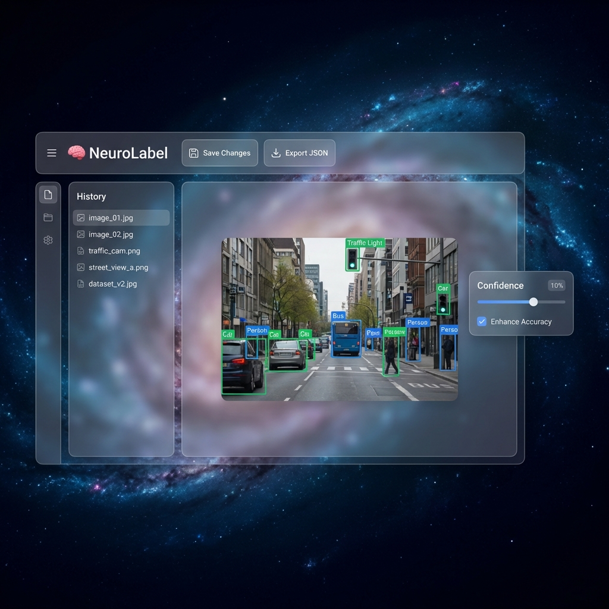

# 🧠 NeuroLabel AI (AV-Labeller)

**NeuroLabel AI** is a next-generation semi-automated labeling tool designed for Autonomous Vehicle (AV) datasets. It leverages **State-of-the-Art Computer Vision (YOLOv8)** to pre-annotate images, allowing human annotators to refine, correct, and export high-quality datasets with minimal effort.



## ✨ Key Features

- **🚀 AI-Assisted Annotation**: Automatically detects objects (Cars, Pedestrians, Traffic Lights) using **YOLOv8**.
- **🎯 Test-Time Augmentation (TTA)**: "Enhance Accuracy" mode runs multi-scale inference to detect small/distant objects.
- **🎨 Interactive Canvas**:
  - **Zoom & Pan**: Fluid navigation for pixel-perfect editing.
  - **Manual Refinement**: Drag, resize, and delete bounding boxes.
- **⚡ Real-time Filtering**: Adjust confidence thresholds dynamically to filter noise.
- **💾 Auto-Save & History**: Persistent database storage (SQLite) tracks all improved annotations.
- **📂 Universal Export**: One-click export to standard JSON formats for model training.

## 🛠️ Tech Stack

- **Frontend**: React, TypeScript, Konva.js (Canvas), Vite, CSS Modules (Glassmorphism UI).
- **Backend**: Python, FastAPI, SQLAlchemy (SQLite), Ultralytics YOLOv8.
- **Model**: YOLOv8 Nano (Speed) / Medium (Accuracy).

## 🚀 Getting Started

### Prerequisites
- Python 3.9+
- Node.js 16+

### 1. Backend Setup
```bash
cd backend
python -m venv venv
source venv/bin/activate  # Windows: venv\Scripts\activate
pip install -r requirements.txt
uvicorn main:app --reload
```
*The server will start at `http://localhost:8000`*

### 2. Frontend Setup
```bash
cd frontend
npm install
npm run dev
```
*The UI will run at `http://localhost:5173`*

## 🎮 Usage Guide

1. **Upload**: Drag & drop an image or select from your drive.
2. **AI Detection**: Click **"Run YOLOv8"**. Use the *Enhance Accuracy* checkbox for difficult images.
3. **Refine**:
   - **Click** a box to select.
   - **Drag** corners to resize.
   - **Del** key to remove incorrect labels.
4. **Export**: Click **"Export JSON"** to download your labelled dataset.

## 📄 License
MIT License. Built for the Open Source Community.
